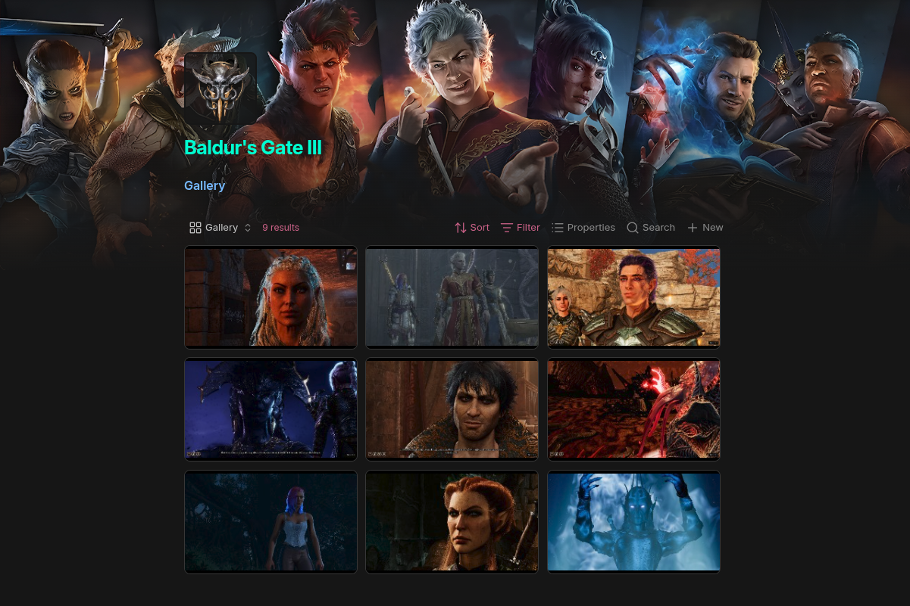

# Steam-Obsidian Integration

A tool to automatically (or manually) add notes for your Steam games to your Obsidian vault as you play them.

## Features
- Automatically detects your most recently played games and adds notes to your Obsidian vault
- Detects non-steam games added to Steam and adds notes for them
- Set a template to customize exactly how you want your game notes to look
- Access a set of variables to assist in per-game template customization
- Scrapes SteamGridDB to bring artwork into your notes
- Set exclusions to skip unwanted games
- FULL SCAN mode to add notes for every game in your Steam library
- Single game mode to add just a single game on demand
- Service mode to always be checking your steam history and adding games as you play
- Dry run mode to see what notes would be added before adding them (STRONGLY recommended for FULL SCAN mode)

## Example
By simply running this service and playing games, your Obsidian vault will automatically update with notes like this:



## Requirements
- [Obsidian Local REST API](https://github.com/coddingtonbear/obsidian-local-rest-api) to connect to your vault and access/create notes
- A [SteamGridDb API key](https://www.steamgriddb.com/profile/preferences/api) if you'd like to scrape artwork
- The script relies upon the Python [vdf](https://pypi.org/project/vdf/) and [python-steamgriddb](https://pypi.org/project/python-steamgriddb/) modules (included in install)

## Installation
1. Clone the repo: `git repo clone BrianC10/steam-obsidian`
2. Enter the repo directory: `cd steam-obsidian`
3. Allow the Install script to be run: `chmod +x install.sh` (or `chmod +x install-cli.sh`) for the non-service version.
4. Install: `./install.sh` (`./install-cli.sh`)

## Configuration

| Setting            | Description                                                                                                                                                                     | Example                                                    |
| ------------------ | ------------------------------------------------------------------------------------------------------------------------------------------------------------------------------- | ---------------------------------------------------------- |
| STEAM_PATH         | The path to your steam directory                                                                                                                                                | `'~/.local/share/Steam'`                                   |
| GET_ICON           | Scrape Icon from SteamGridDb. Requires SteamGridDb API Key                                                                                                                      | `True` or `False`                                          |
| GET_BANNER         | Scrape Icon from SteamGridDb. Requires SteamGridDb API Key                                                                                                                      | `True` or `False`                                          |
| GET_COVER          | Scrape Icon from SteamGridDb. Requires SteamGridDb API Key                                                                                                                      | `True` or `False`                                          |
| GET_RELEASE_DATE   | Scrape Icon from SteamGridDb. Requires SteamGridDb API Key                                                                                                                      | `True` or `False`                                          |
| UPDATE_PLAYTIME    | If note already exists, update playtime. (This is the only "Destructive" action the program is capable of. It should absolutely be fine, but if you're nervous you can skip it) | `True` or `False`                                          |
| FULL_BACKLOG       | Add every item from your Steam library (I STRONGLY recommend doing DRY_RUN=True before doing this, especially if you have a large Steam library)                                | `True` or `False`                                          |
| STEAM_GRID_API_KEY | Your SteamGridDb API Key. **Required** if you enabled any of the GET options above                                                                                              |                                                            |
| OBSIDIAN_API_KEY   | Your Obsidian Local REST API Key                                                                                                                                                |                                                            |
| OBSIDIAN_URL       | Your Obsidian Local REST API URL                                                                                                                                                | `http://127.0.0.1:27123/`                                  |
| OBSIDIAN_DIRECTORY | The directory in your vault you want the game notes to be created                                                                                                               | `Hobbies/Games`                                            |
| EXCLUSIONS         | A list of games you want excluded from note creation. Especially important for non-steam games as the script scans all of them each run                                         | `['Proton Experimental', 'RetroArch', 'Wallpaper Engine']` |
| RUN_INTERVAL       | The interval in minutes before the service will run again                                                                                                                       | `30`                                                       |
| LOG_LEVEL          | The level of logging: 'INFO', 'WARNING', 'DEBUG'                                                                                                                                | `'INFO'`                                                   |
| DRY_RUN            | Will output a list of what notes would be created without actually creating any notes                                                                                           | `True` or `False`                                          |

### Templating
Edit the template file at `~/.config/steam-obsidian/template.txt` to configure what your game note will look like.
The following wildcards can be used to customize your template:


| Wildcard         | Description                                           |
| ---------------- | ----------------------------------------------------- |
| `{title}`        | The title of the game                                 |
| `{release_date}` | The game's release date                               |
| `{cover}`        | Cover art URL                                         |
| `{banner}`       | Banner art URL                                        |
| `{icon}`         | Icon art URL                                          |
| `{id}`           | REQUIRED. Steam game ID (or SteamGridDb ID if a non-steam game) |
| `{playtime}`     | Playtime in minutes                                   |

Obsidian frontmatter goes at the top of notes with `---` above and below all the desired frontmatter fields.
SteamId: {id} is REQUIRED in the frontmatter of your note for the program to work. I didn't want to hardcode it in
because I want the user to have the freedom to arrange their frontmatter themselves, so you MUST make sure your template has this.

#### Example
```txt
---
name: {title}
release date: {release_date}
finished:
cover: {cover}
gallery: {title}
banner: {banner}
icon: {icon}
playing: true
stopped: false
steamId: {id}
playtime: {playtime}
rating: 
---
Hi, the game {title} is my favourite game!

###### Gallery
![[z_/z_bases/Games.base|Games]]
```

## Usage
For a continuously running service:
1. Edit the config as necessary: `nano ~/.config/steam-obsidian/settings.py`
2. Enable the service: `systemctl --user enable steam-obsidian`
3. Start the service: `systemctl --user start steam-obsidian`
4. Check the status: `systemctl --user status steam-obsidian`

##### Editing After First Run
1. Stop the service: `systemctl --user stop steam-obsidian`
2. Edit the config file as necessary: `nano ~/.config/steam-obsidian/settings.py`
3. Restart the service: `systemctl --user restart steam-obsidian`


## Command Line
You can run steam-obsidian from the command line as well. It is still required to edit the settings file at `~/.config/steam-obsidian/settings.py` with your API keys and default settings.

Here is a list of command line arguments you can use:

| Argument                 | Setting                                                                                             |
| ------------------------ | --------------------------------------------------------------------------------------------------- |
| `-s`, `--service`        | Run the program as a continuously running service                                                   |
| `-in`, `--interval`      | The frequency in minutes the program will run in service mode                                       |
| `-i`, `--icon`           | Enable retrieving icon art from SteamGridDb                                                         |
| `-b`, `--banner`         | Enable retrieving banner art from SteamGridDb                                                       |
| `-c`, `--cover`          | Enable retrieving cover art from SteamGridDb                                                        |
| `-r`, `--release`        | Get release date from SteamGridDb                                                                   |
| `-f`, `--full`           | Perform full scan of all games currently on system. (USE DRY RUN FIRST)                             |
| `-t`, `--test`           | DRY RUN. Get a list of the games that will be added without actually adding them.                   |
| `-sgapi`, `--steamapi`   | REQUIRED. Your SteamGridDb API Key. Can also be set in settings.py                                  |
| `-oapi`, `--obsidianapi` | REQUIRED. Your Obsdian Local REST API Key. Can also be set in settings.py                           |
| `-u`, `--url`            | REQUIRED. Your SteamGridDb API Key. Can also be set in settings.py                                  |
| `-d`, `--dir`            | Directory in your Obsidian vault to create notes in. Default is the root directory                  |
| `-e`, `--exclude`        | A comma-separated list of games to exclude from the scan. Format example: `['RetroArch', 'Proton']` |
| `-g`, `--game`           | The Steam ID of a single game you'd like to scan instead of letting the program decide              |

## Optional Obsidian Configuration
If you at all like the look of the example note above, there are some additional steps you can take to make your Obsidian look similar:

### Plugins
- The [Simple Banner](https://community.obsidian.md/plugins/simple-banner) plugin will allow banner art on notes as defined by frontmatter.

### Screenshots
- If you want to add screenshots to your notes as I have you can check out my [Steamscreen](https://github.com/BrianC10/SteamScreen) program, and point the smaller webp files to a folder in your obsidian vault.
- Once your screenshots are in your vault. Create a base note with the following filter:
`file.path.startsWith("path/to/your/screenshots" + this.gallery + "/")`
- Then add an embed of that base note in your note template:
`![[path/to/your/Games.base]]`